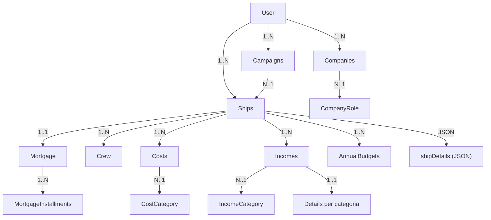

# Analisi operativa – Captain Log Web

## Mappa relazioni (operativa)

## Flusso operativo: setup campagna

1. Definire i **registri di contesto** (Directory): `InterestRate`, `Insurance`, `ShipRole`, `CostCategory`, `IncomeCategory`, `CompanyRole`, `LocalLaw`.
2. Creare una **Campaign** con calendario imperiale (giorno/anno).
3. Creare la **Ship** e compilare la scheda dettagli (JSON `shipDetails`) con M‑Drive/J‑Drive e componenti.
4. Collegare **Crew**, **Mortgage**, **Cost** e **Income** alla nave.

## Flusso operativo: scheda nave

- La scheda dettagli è editata via `ShipDetailsType` e salvata come JSON su `Ship.shipDetails`.
- M‑Drive/J‑Drive hanno campi extra `thrust` e `jump` nel form.
- “Total Cost” è calcolato client‑side sommando i `cost_mcr` e viene salvato nel JSON, ma **non** modifica `Ship.price`.

## Flusso operativo: mutuo

1. Creare il Mortgage sulla Ship (vincolo 1‑1).
2. Firmare il mutuo (richiede `signing_location` e usa data sessione dalla Campaign).
3. Registrare rate: creare `MortgageInstallment` con day/year.
4. Stampare PDF del mutuo tramite template dedicato.

## Flusso operativo: entrate (Income)

- Income è legato a Ship + IncomeCategory + Company + LocalLaw.
- Ogni categoria ha una tabella dettagli dedicata (Freight, Contract, Trade, Prize, ecc.).
- La form usa `ContractFieldConfig` per decidere i campi opzionali in base alla categoria.
- PDF contratto: selezione template in `templates/contracts` e sostituzione placeholder.

## Flusso operativo: costi

- Cost è legato a Ship + CostCategory (+ LocalLaw, Company).
- Le date di pagamento sono in formato imperiale (day/year).

## Flusso operativo: annual budget

- Ogni budget è per **una singola nave**.
- Timeline aggrega **Income**, **Cost** e **MortgageInstallment** per periodo.

## Ownership e sicurezza (operativa)

- Entità principali filtrate per utente (owner) in repository e controller.
- `AssignUserSubscriber` assegna automaticamente l’utente in prePersist.
- I voter bloccano edit/delete se non si è owner o se il mutuo è firmato.

## UI e asset (operativa)

- Asset via Asset Mapper + Tailwind v4 + DaisyUI.
- Sidebar con badge “Beacon // Dock Ready” e separatori per sezioni.
- Login con pannelli separati e immagine dedicata.

## Perché è “Traveller‑centric”

- Tutti i tempi usano day/year imperiale.
- Mutuo e budget seguono cicli a 13 periodi/anno.
- PDF contratti e placeholder mantengono narrativa di sessione.

## Journey operativa (con esempi)

### Sessione di gioco: dalla creazione nave → missione → pagamento → aggiornamento budget

1. **Creazione nave**
   - Ship:
     - `name`: *ISS Far Horizon*
     - `type`: *Far Trader*
     - `class`: *A-1*
     - `price`: *1450000.00*
   - Ship Details (JSON):
     - `hull.cost_mcr`: *450.00*
     - `mDrive.cost_mcr`: *120.00*, `mDrive.thrust`: *2*
     - `jDrive.cost_mcr`: *200.00*, `jDrive.jump`: *2*
     - `powerPlant.cost_mcr`: *90.00*
     - **Total Cost** (auto): *860.00* MCr

2. **Missione / Contratto (Income)**
   - Income (FREIGHT):
     - `title`: *Astan Cargo Run*
     - `amount`: *22000.00*
     - `signingDay/year`: *112/1105*
     - `paymentDay/year`: *118/1105*
   - Freight Details:
     - `origin`: *Astan*
     - `destination`: *Rhylanor*
     - `cargoDescription`: *Refined alloys*
     - `cargoQty`: *40 dtons*

3. **Pagamenti e Costi**
   - Cost (Fuel):
     - `amount`: *4200.00*
     - `paymentDay/year`: *115/1105*
   - MortgageInstallment:
     - `payment`: *7400.00*
     - `paymentDay/year`: *117/1105*

4. **Aggiornamento budget annuale**
   - AnnualBudget (Ship: ISS Far Horizon):
     - `startDay/year`: *101/1105*
     - `endDay/year`: *200/1105*
   - Risultati grafico:
     - **Income**: 22,000.00 Cr
     - **Costs**: 4,200.00 Cr + 7,400.00 Cr (rate mutuo)
     - Timeline con picchi alle date 115, 117, 118.
