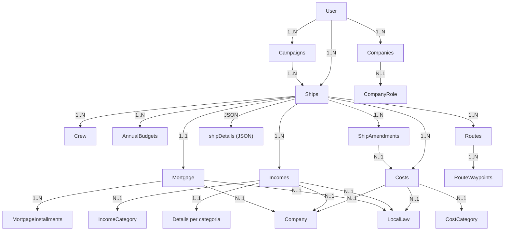

# Analisi operativa – Nav-Fi Web

## Mappa relazioni (operativa)

## Flusso operativo: setup campagna

1. Definire i **registri di contesto** (Directory): `InterestRate`, `Insurance`, `ShipRole`, `CostCategory`, `IncomeCategory`, `CompanyRole`, `LocalLaw`.
2. Creare una **Campaign** con calendario imperiale (giorno/anno).
   - Ogni cambio della session date crea un **log di sessione** con snapshot JSON (Campaign + Ships + log operativi), visibile in pagina dettagli.
3. Creare la **Ship** e compilare la scheda dettagli (JSON `shipDetails`) con M‑Drive/J‑Drive e componenti.
4. I partner commerciali (**Company**) sono **cross-campaign**: li definisci una volta e li riutilizzi su costi, entrate e mutui di qualsiasi campagna per mantenere la coerenza contrattuale.
5. Collegare **Crew**, **Mortgage**, **Cost** e **Income** alla nave.

## Flusso operativo: scheda nave

- La scheda dettagli è editata via `ShipDetailsType` e salvata come JSON su `Ship.shipDetails`.
- M‑Drive/J‑Drive hanno campi extra `thrust` e `jump` nel form.
- “Total Cost” è calcolato client‑side sommando i `cost_mcr` e viene salvato nel JSON, ma **non** modifica `Ship.price`.
- Se il mutuo è firmato, la scheda nave è bloccata: le modifiche ai componenti passano tramite **Ship Amendment** con `patchDetails` (stessa struttura di `shipDetails`) e **Cost reference obbligatoria** (SHIP_GEAR/SHIP_SOFTWARE). La data effetto viene derivata dalla payment date del Cost selezionato.
- La select del Cost reference supporta ricerca testuale (Tom Select) e filtra i costi già usati da altri amendment.
- Le date in UI/PDF sono formattate in `DDD/YYYY` tramite helper condiviso.

## Flusso operativo: mutuo

1. Creare il Mortgage sulla Ship (vincolo 1‑1).
2. Firmare il mutuo (richiede `signing_location` e usa data sessione dalla Campaign).
3. Registrare rate: creare `MortgageInstallment` con day/year.
4. Stampare PDF del mutuo tramite template dedicato.
5. L’equipaggio mostrato nel mutuo (UI + PDF) esclude `Missing (MIA)` e `Deceased` e include solo crew con **active date >= signing date**.

## Flusso operativo: entrate (Income)

- Income è legato a Ship + IncomeCategory + Company + LocalLaw.
- Ogni categoria ha una tabella dettagli dedicata (Freight, Contract, Trade, Prize, ecc.).
- La form usa `IncomeDetailsSubscriber` per agganciare la sottoform corretta in base alla categoria; `ContractFieldConfig` mantiene la mappa dei campi opzionali.
- Lo **status** è automatico: `Draft` di default, `Signed` quando la signing date è completa.
- PDF contratto: selezione template in `templates/pdf/contracts` e sostituzione placeholder.

## Flusso operativo: costi

- Cost è legato a Ship + CostCategory (+ LocalLaw, Company).
- Le date di pagamento sono in formato imperiale (day/year).
- Le righe dettaglio (`detailItems`) alimentano il calcolo dell’amount, che resta read‑only in form.
- I PDF riportano la **template version** per tracciabilità.

## Flusso operativo: annual budget

- Ogni budget è per **una singola nave**.
- Timeline aggrega **Income**, **Cost** e **MortgageInstallment** per periodo.
- Le chiavi day/year sono normalizzate da helper e i filtri accettano `DDD/YYYY` o solo `YYYY`.

## Flusso operativo: routes

- Le Routes sono agganciate a **Campaign + Ship** e costruite tramite waypoint in sequenza.
- I waypoints richiedono `hex` (4 cifre) e `sector` (nome o abbreviazione T5SS) per aprire la mappa `travellermap.com/go/{sector}/{hex}`.
- `startHex/destHex` sono auto‑seal dai waypoints; jumpDistance e fuelEstimate sono calcolati al submit secondo `docs/Traveller-Fuel-Management.md`.

## Ownership e sicurezza (operativa)

- Entità principali filtrate per utente (owner) in repository e controller.
- `AssignUserSubscriber` assegna automaticamente l’utente in prePersist.
- I voter bloccano edit/delete se non si è owner o se il mutuo è firmato.

## UI e UX Tattica (v2.0.x)

- **Bridge Interface**: Asset caricati via Asset Mapper con Tailwind 4 e DaisyUI, ottimizzati per un'estetica sci-fi "Abyss" ad alto contrasto.
- **Tactical Search Terminals**: Le liste (Ship, Crew, Financials) integrano moduli di ricerca con labeling tecnico (`TITLEDATA`, `VESSELNAV`) e design a terminale bridge.
- **Nav-Ops Dashboard**: Sidebar con badge operativi (`Beacon // Dock Ready`) e separatori di sezione per una navigazione intuitiva tra i moduli missione.
- **Data Telemetry Layouts**: Massimizzazione dello spazio orizzontale per i moduli critici (Mortgage, Annual Budget), permettendo la visualizzazione simultanea di metriche, grafici e log azioni.
- **Unified Action Language**: Utilizzo della macro `_tooltip` per uniformare bottoni e interazioni, garantendo feedback visivo costante e assenza di artefatti grafici (protocollo `inline-flex`).
- **Session Timeline**: Log delle modifiche alla Campaign formattato via Highlight.js per una facile lettura dei delta temporali della missione.

## Perché è “Traveller‑centric”

- Tutti i tempi usano day/year imperiale.
- Mutuo e budget seguono cicli a 13 periodi/anno.
- PDF contratti e placeholder mantengono narrativa di sessione.

## Journey operativa (con esempi)

### Sessione di gioco: dalla creazione nave → missione → pagamento → aggiornamento budget

1. **Creazione nave**
   - Ship:
     - `name`: *ISS Far Horizon*
     - `type`: *Far Trader*
     - `class`: *A-1*
     - `price`: *1450000.00*
   - Ship Details (JSON):
     - `hull.cost_mcr`: *450.00*
     - `mDrive.cost_mcr`: *120.00*, `mDrive.thrust`: *2*
     - `jDrive.cost_mcr`: *200.00*, `jDrive.jump`: *2*
     - `powerPlant.cost_mcr`: *90.00*
     - **Total Cost** (auto): *860.00* MCr

2. **Missione / Contratto (Income)**
   - Income (FREIGHT):
     - `title`: *Astan Cargo Run*
     - `amount`: *22000.00*
     - `signingDay/year`: *112/1105*
     - `paymentDay/year`: *118/1105*
   - Freight Details:
     - `origin`: *Astan*
     - `destination`: *Rhylanor*
     - `cargoDescription`: *Refined alloys*
     - `cargoQty`: *40 dtons*

3. **Pagamenti e Costi**
   - Cost (Fuel):
     - `amount`: *4200.00*
     - `paymentDay/year`: *115/1105*
   - MortgageInstallment:
     - `payment`: *7400.00*
     - `paymentDay/year`: *117/1105*

4. **Aggiornamento budget annuale**
   - AnnualBudget (Ship: ISS Far Horizon):
     - `startDay/year`: *101/1105*
     - `endDay/year`: *200/1105*
   - Risultati grafico:
     - **Income**: 22,000.00 Cr
     - **Costs**: 4,200.00 Cr + 7,400.00 Cr (rate mutuo)
    - Timeline con picchi alle date 115, 117, 118.

## Gestione equipaggio (status e date)

- Gli status disponibili sono: **Active**, **On Leave**, **Retired**, **Missing (MIA)**, **Deceased**.
- Status e data relativa sono richiesti solo quando la ship è selezionata; la data appare insieme allo status nella form.
- Quando si assegna un crew alla ship dalla lista “unassigned”, lo status diventa **Active** e la data attiva è impostata alla **session date** corrente (Campaign se presente, altrimenti Ship).
- Quando un crew viene **sganciato** dalla ship:
  - `status` viene azzerato se non è `Missing (MIA)`/`Deceased`;
  - le date **Active/On Leave/Retired** vengono azzerate;
  - le date **MIA/Deceased** restano intatte (storico eventi).
- La lista degli **unassigned crew** esclude i profili `Missing (MIA)` e `Deceased`.
