# Nav-Fi³ Web – Analisi Operativa

> **Obiettivo**: Definire i flussi di lavoro standard per l'ufficiale di rotta e il Referee.

## 1. Mappa Concettuale delle Relazioni

```mermaid
graph TD
    User((Utente)) --> Campaign
    User --> Company["Company (Cross-Campaign)"]
    
    Campaign["Campaign (Time Cursor)"] --> Ship
    
    Ship --> Crew
    Ship --> Mortgage
    Ship --> Route
    Ship --> Ledger["Ledger (Financial Core)"]
    
    Ledger --> Income
    Ledger --> Cost
    Ledger --> SalaryPayment
    Ledger --> MortgageInstallment
```

## 2. Flusso: Setup Iniziale "Commissioning"

1.  **Context Load**: Assicurarsi che le tabelle di contesto (`ShipRole`, `LocalLaw`, ecc.) siano popolate.
2.  **Campaign Init**: Creare la Campagna. Impostare la data iniziale (es. 001-1105).
3.  **Ship Registration**:
    *   Compilare i dati base (Nome, Classe).
    *   Definire i dettagli tecnici (Hull, Drives) nella scheda JSON.
    *   *Nota*: Il "Prezzo" della nave è un campo manuale, ma può essere derivato dalla somma dei componenti.
4.  **Mortgage Signing**:
    *   Se la nave non è pagata cash, creare un Mutuo.
    *   Firmare il mutuo alla data corrente della campagna.
    *   Questo genera il PDF "Atto di Mutuo".

## 3. Flusso: Ciclo Operativo di Missione

### Fase 1: Briefing & Rotta
1.  **Definizione Rotta**: Usare il modulo `Routes`.
    *   Inserire Hex partenza e destinazione.
    *   Verificare distanza (Jump-1, Jump-2...) e consumo fuel.
    *   Consultare TravellerMap via link integrato per rischi di sistema (Amber/Red Zones).
2.  **Reclutamento**: Assegnare Crew dalla lista "Unassigned".
    *   Lo status passa ad `Active`.
    *   La data di attivazione diventa la data corrente.

### Fase 2: Contratti (Income)
1.  Creare un `Income` (es. "Freight - 200 tonnellate").
2.  Collegare una `Company` come controparte.
3.  Impostare:
    *   `Signing Date` (Oggi).
    *   `Payment Date` (Prevista all'arrivo).
4.  Il sistema calcola eventuali depositi (anticipi) e li posta subito sul Ledger (`Transaction` POSTED).
5.  Il saldo finale viene creato come `Transaction` PENDING (futura).

### Fase 3: Esecuzione & Spese (Cost)
1.  Registrare spese correnti: Fuel, Life Support, Berthing Fees.
2.  Ogni spesa riduce il saldo immediatamente (se pagata cash) o alla data indicata.

### Fase 4: Chiusura & Salto Temporale
1.  **Arrivo a destinazione**: Il Referee avanza la data della Campagna (es. +7 giorni per il salto + 1 giorno manovra).
2.  **Sync**: Il sistema rileva il cambio data.
    *   Le transazioni PENDING (il saldo del contratto Freight) diventano POSTED.
    *   I fondi vengono accreditati.
    *   Vengono generati i ratei stipendio (se scaduti i 28 giorni).

## 4. Gestione Anomalie

### Annullamento Contratti (Void)
Se una missione fallisce:
1.  Andare sul dettaglio `Income`.
2.  Impostare `Cancel Date`.
3.  La transazione PENDING del saldo finale viene marcata `VOID` (Annullata).
4.  Il PDF del contratto riceve un watermark "VOID".

### Ristrutturazione Debito
Se il mutuo non può essere pagato:
1.  Non modificare le rate passate.
2.  Usare il comando di "Refinance" (se implementato) o annotare l'evento nel Log di Campagna.
3.  Il sistema segnalerà "Hard Deck Breach" (Insolvenza) se il saldo va sotto zero.

## 5. Interfaccia Tattica (UX Guide)
*   **Dashboard**: Monitorare i widget "Solvency" e "Fuel".
*   **Color Codes**:
    *   Cyan/Azure: Operativo / Normale.
    *   Emerald: Finanziario Positivo (Entrate).
    *   Amber: Attenzione / Pending.
    *   Red: Critico / Debito / Spesa.
*   **Badge**: Usare i badge rapidi per vedere a colpo d'occhio stato contratti e crew (es. "MIA", "SIGNED").
