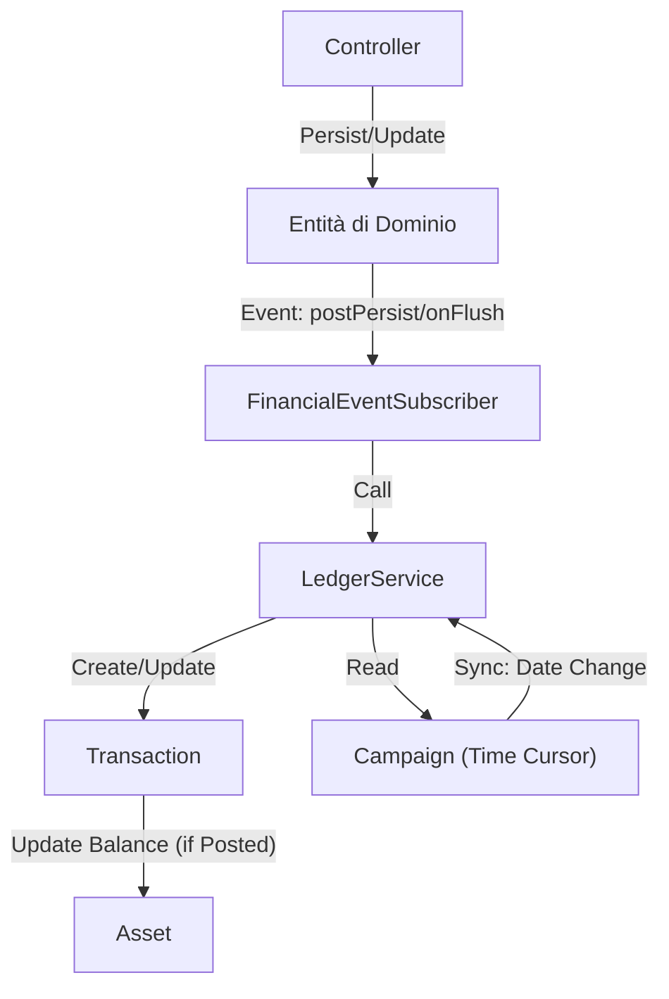

# Analisi del Financial Core di Nav-Fi

Questo documento fornisce un'analisi approfondita dell'architettura finanziaria di Nav-Fi, concentrandosi sul **Ledger Service** (Servizio Mastro), sulle **Entità Finanziarie** e sulla logica del **Time Cursor** (Cursore Temporale).

## 1. Filosofia Core: Ledger Event-Driven

L'applicazione separa l'**Intento del Dominio** (es. "Ho firmato un contratto", "Ho pagato una rata del mutuo") dalla **Realtà Finanziaria** (Flusso di cassa).

- **Entità di Dominio** (`Income`, `Cost`, `MortgageInstallment`) rappresentano la *logica di business* e l'*intento*.
- **Il Ledger** (`Transaction`) rappresenta la *realtà di cassa*.
- **La Sincronizzazione** è gestita automaticamente tramite il `FinancialEventSubscriber`. I Controller non toccano quasi mai direttamente il Ledger.

## 2. Il Ledger (Entità Transaction)

L'entità `Transaction` è l'unica fonte di verità per il saldo di un Asset.

### Campi Chiave
- **Amount**: `DECIMAL(15,2)` salvato come stringa (compatibile con BCMath). Positivo per depositi, negativo per prelievi.
- **Status**:
    - `Verified (Posted)`: La transazione è avvenuta e ha influenzato il saldo.
    - `Pending`: La transazione è programmata per una data futura (logica Time Cursor).
    - `Verified (Void)`: La transazione è stata annullata/stornata.
- **Session Date**: La Data Imperiale di gioco (`Day`, `Year`) in cui avviene la transazione.
- **Relazioni**: Collegata a un `Asset` e opzionalmente a un'entità sorgente (`relatedType`/`relatedId`) per tracciabilità.

## 3. La Logica "Time Cursor"

Nav-Fi supporta il "Viaggio nel Tempo" (Time Travel). L'entità `Campaign` mantiene la **Data di Sessione Corrente** (`sessionDay`, `sessionYear`). Questa data agisce come un cursore che determina quali transazioni sono effettive.

### La Regola "Effective" nel `LedgerService`
Una transazione influenza il saldo dell'Asset (Crediti) **solo se**:
1. Non è `Void`.
2. `Data Transazione <= Data Sessione Campagna`.

### Meccanica del Time Travel
Quando la data della Campagna cambia (aggiornamento `CampaignSessionLog`), viene eseguito un processo di sincronizzazione (`LedgerService::processCampaignSync`):
- **Avanti nel Tempo**: Le transazioni che erano `Pending` ma ora sono nel passato (poiché la data è avanzata) diventano `Posted`, e i loro importi vengono applicati al saldo dell'Asset.
- **Indietro nel Tempo** (Undo): Le transazioni che erano `Posted` ma ora si trovano nel futuro ritornano `Pending`, e i loro importi vengono *stornati* dal saldo.

## 4. Strategia di Reversal (Proxy di Immutabilità)
Per mantenere l'integrità dei dati durante le modifiche, il sistema utilizza una **Strategia di Reversal** tramite `FinancialEventSubscriber`.

Se un'entità finanziaria (es. un `Cost`) viene aggiornata:
1. **Reverse**: Il sistema trova le transazioni esistenti per quell'entità e crea contro-transazioni (importo negativo dell'originale) per azzerarle.
2. **Re-Create**: Vengono create nuove transazioni basate sui dati aggiornati dell'entità.

Questo garantisce che, anche se l'importo di un costo cambia, la storia del ledger rifletta la correzione anziché mutare semplicemente la riga originale (sebbene in alcuni casi si usi `Void`, il reversal permette una contabilità rigorosa).

## 5. Analisi delle Entità

### A. Annual Budget
- **Ruolo**: Uno strumento di *proiezione* e *reporting*, NON un ledger.
- **Calcolo**: Itera su tutte le entità `Income` e `Cost` attive collegate a un Asset.
- **Logica**: Non interroga il Ledger. Calcola "Cosa *dovrebbe* accadere quest'anno" basandosi sui contratti.
- **Actual Budget**: Confronta i totali proiettati con il costo teorico del Mutuo + Spese.

### B. Mortgage (Mutuo)
- **Rate**: I pagamenti sono eventi manuali (`MortgageInstallment`).
- **Logica**: Quando una rata viene persistita, il Subscriber la rileva e crea una transazione di `prelievo` sul Ledger.

### C. Income (Entrate)
- **Ciclo di Vita Complesso**:
    - **Deposito**: Se un contratto ha un deposito iniziale, viene creata una transazione alla `signingDate`.
    - **Pagamento Finale**: Il saldo rimanente (Totale + Bonus - Deposito) è programmato per la `paymentDate`.
    - **Cancellazione**: Se un Income viene cancellato, la logica controlla la data di cancellazione rispetto alla data di pagamento per eventualmente rendere Void la transazione.

### D. Salary (Salari)
**Novità v1.2.0**: Gestisce i pagamenti ricorrenti dell'equipaggio.
- **Ciclo**: Fisso di 28 giorni (Regolamento Imperiale).
- **Relazione**: 1-a-Molti con `Crew` (permette storico contrattuale).
- **Transazioni**: Genera `SalaryPayment` collegati al Ledger.
- **Pro-rata**: Calcolo automatico all'assunzione `(Salary / 28) * Days`.

## 6. Performance & Ottimizzazione (v1.2.0)

### 6.1. Indici Database
Per garantire la scalabilità del Ledger, sono stati introdotti indici strategici:
- `idx_transaction_sync` (`[account_id, date_time]`): Ottimizza la ricostruzione del saldo e la verifica della cronologia.
- `idx_transaction_chronology` (`[date_time]`): Velocizza le query basate sul tempo (es. report annuali).

### 6.2. Strategia "Cold Storage" (Fiscal Year Closure)
[IMPLEMENTED] Per mantenere il sistema performante, è stato implementato il meccanismo di chiusura annuale.
- **TransactionArchive**: Le transazioni vengono spostate in una tabella di archivio separata (`transaction_archive`).
- **Snapshot**: Viene creato un movimento "Rendiconto Iniziale" (Snapshot) per l'anno successivo che preserva il saldo.
- **CLI**: Il comando `app:fiscal-close` permette di eseguire l'operazione in sicurezza (irreversibile).

## 7. Diagramma Architetturale

## 8. Raccomandazioni e UX

### 8.1. Immutabilità
Attualmente, l'immutabilità rigorosa (append-only) è parzialmente implementata via reversal. Assicurarsi che non vengano MAI eseguiti `UPDATE` manuali su `Transaction.amount`.

### 8.2. UX: Voice of the Machine
L'interfaccia adotta un tono "Tactical Sci-Fi" per le notifiche di sistema, trattando l'utente come un ufficiale di comando.

#### Protocolli di Notifica
- **Temporal Reconciliation**: Conferma il successo della sincronizzazione temporale e il ricalcolo della solvibilità.
- **Ledger Integrity Event**: Avvisa di modifiche dirette a transazioni passate (Reversal), indicando l'archiviazione per audit.
- **Causality Locked**: Indica transazioni future (Pending) in attesa dell'arrivo del Cursore Temporale.
- **Hard Deck Breach**: Allarme critico per saldo negativo (insolvenza imminente).

### 8.3. Suggerimenti Futuri: Income Cycle
La gestione attuale "Deposito -> Pagamento Finale" è solida.
- **Late Fee (Penale)**: In futuro, se la data di consegna viene mancata (`Time Cursor > Payment Date` senza trigger dell'evento consegna), si potrebbe applicare una penale automatica per incentivare la puntualità, aggiungendo realismo "cattivo" all'universo Nav-Fi.
