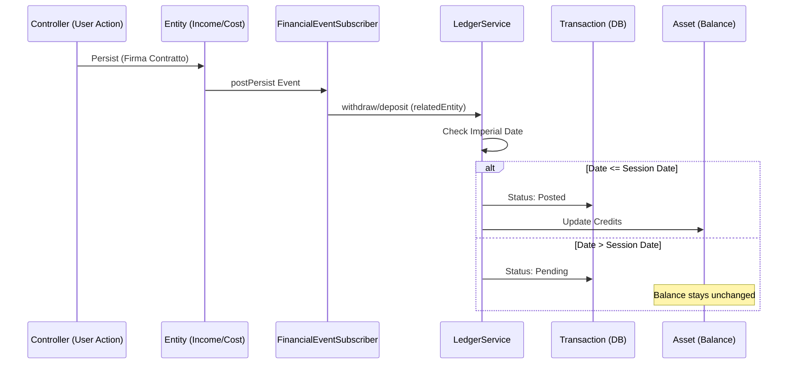

# Deep Dive: Il Sistema Ledger di Nav-Fi

## 1. Visione d'Insieme
Il sistema Ledger di Nav-Fi è il "motore di verità" finanziario dell'applicazione. Non si limita a registrare transazioni, ma implementa un modello di contabilità deterministico basato sul **Tempo Imperiale** e sulla **Sincronizzazione Event-Driven**.

### Filosofia Architetturale
- **Decoupling**: La logica di business (es. "quanto costa un motore") è separata dalla logica di cassa ("preleva X crediti").
- **Determinismo Temporale**: Il saldo di un Asset è una funzione della data attuale della Campagna.
- **Append-Only (Quasi)**: Le modifiche avvengono tramite storni (reversals), preservando la cronologia.

---

## 2. Componenti Chiave

### A. L'Entità `Transaction`
È l'atomo del sistema. Ogni riga rappresenta un movimento di crediti.
- **Schema**:
    - `amount`: `DECIMAL(15,2)` (via BCMath).
    - `status`: `Pending` | `Posted` | `Void`.
    - `sessionDay`/`sessionYear`: Data imperiale di competenza.
    - `createdAt`: Timestamp reale (audit).
    - `relatedEntityType`/`relatedEntityId`: Il "perché" della transazione (es. `Cost`, `Income`).

### B. `LedgerService`
L'orchestratore che manipola il Ledger.
- **Responsabilità**:
    - Creazione di transazioni (`deposit`, `withdraw`).
    - Calcolo dell'efficacia temporale (`isEffective`).
    - Sincronizzazione massiva durante il "Time Travel" (`processCampaignSync`).

### C. `FinancialEventSubscriber`
La centrale di automazione.
- Intercetta la persistenza/modifica di entità di dominio (`Income`, `Cost`, `MortgageInstallment`, `SalaryPayment`).
- Traduce questi eventi in transazioni del ledger senza intervento manuale nei controller.

---

## 3. La Logica del "Time Cursor"

Il sistema Nav-Fi permette ai Referee di muovere la data della Campagna avanti e indietro. Il Ledger reagisce dinamicamente:

### Stato `Pending` (Il Futuro)
Se una transazione è datata *dopo* la data attuale della Campagna:
- Status = `Pending`.
- **Non** influenza il saldo dell'Asset.

### Stato `Posted` (Il Presente/Passato)
Se la data della Campagna raggiunge o supera la data della transazione:
- Status = `Posted`.
- L'importo viene sommato/sottratto dal saldo dell'Asset (`credits`).

### Meccanica della Sincronizzazione (`processCampaignSync`)
1. **Passaggio in Avanti**: Cerca transazioni `Pending` la cui data è diventata `<=` alla nuova data di sessione. Le converte in `Posted` e aggiorna i crediti.
2. **Backtrack (Viaggio nel Passato)**: Cerca transazioni `Posted` che ora risultano nel futuro. Le riporta a `Pending` e *sottrae* (storna) l'importo dai crediti dell'Asset.

---

## 4. Gestione delle Modifiche: Reversal Strategy

Nav-Fi non modifica mai l'importo di una transazione esistente per evitare disallineamenti.

### Flusso di Aggiornamento/Cancellazione:
1. **Identificazione**: Il sistema cerca tutte le transazioni collegate all'ID dell'entità modificata.
2. **Reversal**: Per ogni transazione trovata, ne crea una identica ma con segno opposto.
    - Es: Se un Costo di 500 viene modificato, il sistema crea una transazione di +500 con descrizione "REVERSAL".
3. **Re-Creation**: Viene creata la nuova transazione corretta.

Questo garantisce che il saldo finale sia corretto e che esista un audit log di ogni correzione.

---

## 5. Performance e Scalabilità

Con la crescita di una campagna (centinaia di transazioni per decine di navi), le query di sincronizzazione diventano critiche. Abbiamo implementato una strategia di indicizzazione avanzata:

### Indici Ottimizzati:
- `idx_transaction_sync`: `(asset_id, status, session_year, session_day)`
    - Usato per trovare istantaneamente cosa deve cambiare stato durante il Time Travel.
- `idx_transaction_chronology`: `(asset_id, session_year, session_day, created_at)`
    - Usato per visualizzare il Ledger in ordine cronologico perfetto (giorno imperiale + ordine di inserimento reale).

---

## 6. Flusso Dati (Mermaid)

---

## 7. Troubleshooting e Integrità
- **Floating Point**: Il sistema usa esclusivamente `BCMath` (stringhe) per tutte le somme e sottrazioni. Il tipo `float` è bandito dal Ledger.
- **Orphan Transactions**: Le transazioni sono legate via ID debole (`relatedEntityId`) per permettere la cancellazione delle entità di dominio senza distruggere la storia del mastro (sebbene solitamente si usi il reversal).
- **Audit**: Il campo `createdAt` reale permette di ricostruire la sequenza temporale reale degli inserimenti, fondamentale per risolvere contenziosi tra giocatori e arbitro.
